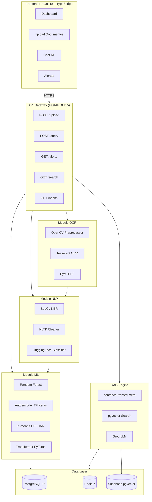

# DocSalud MX

<div align="center">


**Sistema de Digitalizacion Inteligente de Expedientes Clinicos**

*Digitalizando la salud rural mexicana con Inteligencia Artificial*

[](https://github.com/saidbriones/docsalud-mx/actions/workflows/ci.yml)
[](https://github.com/saidbriones/docsalud-mx/actions/workflows/cd.yml)
[](https://www.python.org/downloads/)
[](https://fastapi.tiangolo.com)
[](https://react.dev)
[](https://www.typescriptlang.org)
[](https://www.docker.com)
[](https://www.postgresql.org)
[](./LICENSE)
[](https://github.com/psf/black)
[](./backend/tests)
[](https://docsaludmx.ochoceroocho.mx)

[Demo en vivo](https://docsaludmx.ochoceroocho.mx) · [API Docs](https://docsaludmx.ochoceroocho.mx/docs) · [Reportar Bug](https://github.com/saidbriones/docsalud-mx/issues) · [Solicitar Feature](https://github.com/saidbriones/docsalud-mx/issues)

</div>

---

## Problema

En Mexico, **mas de 15,000 clinicas rurales** manejan expedientes medicos exclusivamente en papel. Esto genera:

- Perdida de historiales clinicos al transferir pacientes entre niveles de atencion
- Imposibilidad de dar seguimiento a enfermedades cronicas (diabetes, hipertension, CKD)
- Diagnosticos duplicados y tratamientos contradictorios
- Tiempo excesivo del personal medico en tareas administrativas
- Incapacidad para detectar patrones y generar alertas preventivas

## Solucion

DocSalud MX es un sistema de AI que transforma fotografias de expedientes fisicos en datos estructurados, consultables e inteligentes:

| Capacidad | Descripcion |
|-----------|-------------|
| **OCR Medico** | Extrae texto de fotos y PDFs con >85% de precision usando OpenCV + Tesseract |
| **NLP Especializado** | Identifica medicamentos, diagnosticos, dosis y valores de laboratorio con SpaCy |
| **Clasificacion ML** | Clasifica automaticamente recetas, labs y notas medicas con ensemble de modelos |
| **Deteccion de Anomalias** | Identifica valores criticos de laboratorio con autoencoder TF/Keras |
| **Clustering de Riesgo** | Agrupa pacientes por perfil de riesgo con K-Means/DBSCAN |
| **RAG Medico** | Responde preguntas en lenguaje natural sobre expedientes con Groq LLM + pgvector |
| **Alertas Inteligentes** | Genera alertas clinicas automaticas por valores fuera de rango |

---

## Arquitectura



---

## Stack Tecnologico

<table>
<tr>
<th>Capa</th>
<th>Tecnologias</th>
<th>Version</th>
<th>Proposito</th>
</tr>
<tr>
<td><b>OCR / Vision</b></td>
<td>


</td>
<td>4.10 / 0.3.13 / 1.25</td>
<td>Extraccion de texto de imagenes y PDFs</td>
</tr>
<tr>
<td><b>NLP</b></td>
<td>


</td>
<td>3.8 / 3.9 / 4.47</td>
<td>NER medico, limpieza de texto, clasificacion</td>
</tr>
<tr>
<td><b>ML</b></td>
<td>


</td>
<td>1.6 / 2.5 / 2.18</td>
<td>Clasificacion supervisada, anomalias, clustering</td>
</tr>
<tr>
<td><b>RAG / LLMs</b></td>
<td>


</td>
<td>llama-3.3-70b</td>
<td>Embeddings locales + busqueda semantica + respuestas LLM</td>
</tr>
<tr>
<td><b>API</b></td>
<td>


</td>
<td>0.115 / 2.10 / 2.0</td>
<td>REST API async, validacion, ORM</td>
</tr>
<tr>
<td><b>Frontend</b></td>
<td>


</td>
<td>18 / 5.7 / 3.4</td>
<td>Dashboard interactivo, upload, chat</td>
</tr>
<tr>
<td><b>Infra</b></td>
<td>


</td>
<td>29.2 / 1.25 / EC2</td>
<td>Contenerizacion, reverse proxy, produccion</td>
</tr>
<tr>
<td><b>Base de Datos</b></td>
<td>


</td>
<td>16 / 7 / pgvector</td>
<td>Datos estructurados, cache, busqueda vectorial</td>
</tr>
</table>

---

## Quick Start

### Requisitos previos

- Docker 20+ y Docker Compose 2+
- 4GB RAM disponibles
- Cuentas en: Groq API (gratuito), Supabase (gratuito)

### 3 comandos para levantar

```bash
# 1. Clonar el repositorio
git clone https://github.com/saidbriones/docsalud-mx.git
cd docsalud-mx

# 2. Configurar entorno
cp .env.example .env
# Editar .env con tus API keys

# 3. Levantar con Docker
make dev
```

| Servicio | URL |
|----------|-----|
| Frontend | http://localhost:5173 |
| API Docs (Swagger) | http://localhost:8000/docs |
| API Docs (ReDoc) | http://localhost:8000/redoc |
| Health Check | http://localhost:8000/api/v1/health |

### Configuracion rapida del .env

```bash
# Groq API (gratis en console.groq.com)
GROQ_API_KEY=gsk_...

# Supabase (gratis en supabase.com)
SUPABASE_URL=https://xxx.supabase.co
SUPABASE_KEY=eyJhbG...

# Generados automaticamente
SECRET_KEY=$(openssl rand -hex 32)
```

---

## Estructura del Proyecto

```
docsalud-mx/
├── backend/
│   ├── app/
│   │   ├── api/v1/endpoints/     # Upload, patients, documents, search, query, alerts, health
│   │   ├── core/
│   │   │   ├── ocr/              # OpenCV + Tesseract + PyMuPDF
│   │   │   ├── nlp/              # SpaCy NER + NLTK + HuggingFace
│   │   │   ├── ml/               # Sklearn + PyTorch + TF/Keras
│   │   │   ├── rag/              # Embeddings + pgvector + Groq LLM
│   │   │   └── alerts/           # Reglas clinicas + risk scoring
│   │   ├── db/                   # SQLAlchemy models + Alembic migrations
│   │   └── services/             # DocumentService, SearchService, AlertService
│   ├── models/                   # Modelos ML serializados
│   ├── data/                     # Datos sinteticos y de referencia
│   ├── notebooks/                # Exploration notebooks
│   └── tests/                    # Unit + Integration + E2E
├── frontend/
│   └── src/
│       ├── components/           # Upload, Dashboard, PatientDetail, ChatInterface
│       ├── hooks/                # useUpload, usePatients, useSearch, useChat
│       └── services/             # API client con Axios + React Query
├── infrastructure/
│   ├── nginx/                    # Reverse proxy config con SSL
│   └── scripts/                  # Deploy, backup, SSL init, healthcheck
├── .github/workflows/            # CI (lint+test) + CD (deploy AWS)
└── docs/
    ├── model-cards/              # Documentacion de cada modelo ML
    ├── sprint-retrospectives/    # Documentacion Scrum por sprint
    └── deployment-guide.md      # Guia completa de deploy AWS
```

---

## API Endpoints

| Metodo | Endpoint | Descripcion |
|--------|----------|-------------|
| `POST` | `/api/v1/upload` | Sube imagen/PDF de expediente para procesar |
| `GET` | `/api/v1/patients` | Lista pacientes con paginacion |
| `GET` | `/api/v1/patients/{id}` | Detalle del paciente |
| `GET` | `/api/v1/patients/{id}/documents` | Documentos de un paciente |
| `POST` | `/api/v1/query` | Consulta en lenguaje natural (RAG) |
| `GET` | `/api/v1/search` | Busqueda semantica en expedientes |
| `GET` | `/api/v1/alerts` | Alertas activas (filtrables por severidad) |
| `POST` | `/api/v1/classify` | Clasifica tipo de documento |
| `GET` | `/api/v1/health` | Estado de todos los componentes |

Documentacion interactiva completa: [https://docsaludmx.ochoceroocho.mx/docs](https://docsaludmx.ochoceroocho.mx/docs)

---

## Modelos ML

| Modelo | Tipo | Framework | Accuracy | Proposito |
|--------|------|-----------|----------|-----------|
| **document-classifier** | Random Forest + SVM Ensemble | Scikit-learn | ~92% | Clasifica tipo de documento medico |
| **ner-medical** | NER con SpaCy | SpaCy 3.8 | ~88% F1 | Extrae entidades medicas (medicamentos, diagnosticos, etc.) |
| **anomaly-detector** | Autoencoder | TensorFlow/Keras | AUC ~0.94 | Detecta valores de laboratorio anormales |
| **risk-clusterer** | K-Means + DBSCAN | Scikit-learn | Silhouette ~0.67 | Agrupa pacientes por perfil de riesgo |

Ver [docs/model-cards/](./docs/model-cards/) para documentacion detallada de cada modelo.

---

## Comandos Utiles

```bash
make help              # Ver todos los comandos disponibles
make dev               # Desarrollo local con hot-reload
make test              # Ejecutar todos los tests
make test-unit         # Solo tests unitarios
make test-integration  # Solo tests de integracion
make lint              # Verificar estilo de codigo (black + ruff + mypy)
make format            # Formatear codigo automaticamente
make docker-build      # Build de imagenes Docker de produccion
make docker-up         # Levantar stack de produccion local
make migrate           # Ejecutar migraciones de DB
make generate-data     # Generar datos sinteticos de entrenamiento
make train-ner         # Entrenar modelo NER personalizado
make train-classifier  # Entrenar clasificadores ML
make clean             # Limpiar artefactos de build
```

---

## Deploy en Produccion

La aplicacion esta desplegada en AWS EC2 (Ubuntu 24.04) con:
- **HTTPS** via Let's Encrypt (auto-renovacion)
- **NGINX** como reverse proxy con rate limiting
- **Docker Compose** para orquestar todos los servicios
- **GitHub Actions** para CI/CD automatico

Guia detallada: [docs/deployment-guide.md](./docs/deployment-guide.md)

**URL de produccion:** [https://docsaludmx.ochoceroocho.mx](https://docsaludmx.ochoceroocho.mx)

---

## Flujo de Procesamiento

```
Imagen/PDF
    │
    ▼
[OpenCV Preprocessor]
    │ deskew, denoise, adaptive threshold
    ▼
[Tesseract / PyMuPDF]
    │ texto crudo + confianza
    ▼
[NLTK Text Cleaner]
    │ correccion OCR, normalizacion, segmentacion
    ▼
[SpaCy NER Extractor]
    │ entidades: medicamentos, diagnosticos, valores, fechas
    ▼
[HuggingFace + Sklearn Classifiers]
    │ tipo: receta | laboratorio | nota_medica | referencia
    ▼
[sentence-transformers + pgvector]
    │ embeddings 384-dim, almacenados en Supabase
    ▼
[Rules Engine + Anomaly Detector]
    │ alertas clinicas por condiciones de riesgo
    ▼
[PostgreSQL]
    └ expediente digitalizado y consultable
```

---

## Datos Sinteticos y Privacidad

- **NINGUN dato real de paciente** esta en este repositorio
- Los datos de demo son 100% sinteticos, generados con nombres/CURP ficticios
- El script `scripts/generate_synthetic_data.py` genera 2000+ documentos de entrenamiento
- En produccion, los datos de pacientes se almacenan en PostgreSQL con cifrado en reposo
- Los embeddings en pgvector no contienen datos identificadores

---

## Testing

```bash
# Ejecutar suite completa
pytest backend/tests/ -v --cov=app --cov-report=html

# Solo por modulo
pytest backend/tests/unit/test_ocr_preprocessor.py -v
pytest backend/tests/unit/test_ner_extractor.py -v
pytest backend/tests/integration/ -v

# Ver reporte de cobertura
open htmlcov/index.html
```

Cobertura objetivo: **>80%** en unit tests, **100% happy path** en integration tests.

---

## Contribuir

1. Fork el repositorio
2. Crea tu branch: `git checkout -b feature/DSM-XXX-descripcion`
3. Commit con Conventional Commits: `git commit -m "feat(ocr): add adaptive threshold"`
4. Push y abre un Pull Request a `develop`
5. El CI debe pasar antes del merge

Ver [CONTRIBUTING.md](./CONTRIBUTING.md) para mas detalles.

---

## Roadmap

- [x] Fase 1: Modulo OCR (OpenCV + Tesseract + PyMuPDF)
- [x] Fase 2: Modulo NLP (SpaCy + NLTK + HuggingFace + BS4)
- [x] Fase 3: Modulo ML (Sklearn + TF + PyTorch)
- [x] Fase 4: RAG Engine (pgvector + Groq LLM)
- [x] Fase 5: API FastAPI completa
- [x] Fase 6: Frontend React dashboard
- [x] Fase 7: DevOps Docker + CI/CD
- [x] Fase 8: Deploy AWS EC2 con HTTPS
- [ ] Fine-tuning de NER con anotaciones medicas reales
- [ ] Integracion con FHIR (estandar internacional de salud)
- [ ] App movil React Native para captura en campo
- [ ] Dashboard de analytics para autoridades de salud
- [ ] Integracion con sistemas IMSS/ISSSTE

---

## Autor

**Said Ivan Briones Moreno** — Senior AI Solutions Engineer

[](https://github.com/saidbriones)
[](https://linkedin.com/in/saidbriones)

---

## Licencia

[MIT](./LICENSE) — Said Ivan Briones Moreno, 2026.

---

*Construido con Python 3.11, FastAPI, React 18, y mucho cafe. Desplegado en AWS.*
